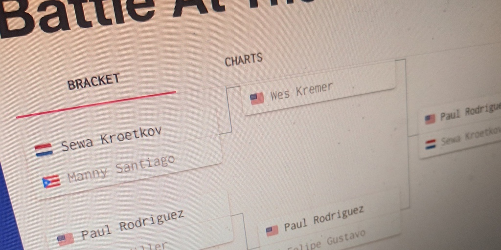

import {Box, GridList, GridListTile} from '@material-ui/core';

<Box mb={4}>
  <GridList cellHeight={300} cols={3}>
    <GridListTile cols={1}>
      
    </GridListTile>
    <GridListTile cols={2}>
      
    </GridListTile>
  </GridList>
</Box>

_BATB Stats_ is a resource for detailed breakdowns of games played in the Battle at the Berrics tournament series. We make all of our data available to explore using charts, tables, brackets, and game transcripts.

I'm serving this data over a public GraphQL API, so other skateboard-loving developers can use it in their apps, too!
